  

  Building reliable LLM agents, post-training pipelines, and NLP systems with a focus on traceability and secure execution.

  <code>Python</code>&nbsp;&nbsp;
  <code>PyTorch</code>&nbsp;&nbsp;
  <code>Transformers</code>&nbsp;&nbsp;
  <code>LLM Agents</code>&nbsp;&nbsp;
  <code>Post-training</code>&nbsp;&nbsp;
  <code>NLP</code>

## Selected work

<table>
  <tr>
    <td width="100%" valign="top">
      <h3><a href="https://github.com/luojingkun22/RepoPilot">RepoPilot ↗</a></h3>
      
<strong>Auditable Code Agent Runtime &amp; LLM Post-Training Pipeline</strong>

      

        A Code Agent with seven typed repository tools, no-network Docker execution,
        exact patch approval, and atomic checkpoint/resume—paired with a Qwen3-4B
        QLoRA SFT/DPO pipeline over the same action protocol.
      

      

        <strong>Runtime impact:</strong> In a same-model, same-task paired evaluation
        while maintaining the same task resolution, API calls fell by
        <strong>62.24%</strong>, API cost by <strong>77.64%</strong>, and wall time by
        <strong>55.89%</strong>.
      

      

        <strong>SFT result:</strong> On a frozen 104-example held-out next-action
        evaluation, exact action accuracy improved from
        <strong>25/104 (24.0%)</strong> to <strong>60/104 (57.7%)</strong>.
      

      

        <strong>DPO engineering:</strong> Execution-grounded training with same-state
        executable preference pairs, state-disjoint validation, and an explicit
        frozen reference policy.
      

      

        <a href="https://github.com/luojingkun22/RepoPilot">Source &amp; documentation ↗</a>
        &nbsp;·&nbsp;
        <a href="https://github.com/luojingkun22/RepoPilot/blob/main/docs/experiments/verified-results.md">Verified results ↗</a>
      

    </td>
  </tr>
</table>

<table>
  <tr>
    <td width="50%" valign="top">
      <h3><a href="https://github.com/luojingkun22/acquabench">AcquaBench ↗</a></h3>
      
Explainable auditing for success provenance in LLM agent trajectories.

      
<a href="https://luojingkun22.github.io/acquabench/">Live demo report ↗</a>

    </td>
    <td width="50%" valign="top">
      <h3><a href="https://github.com/luojingkun22/SenFlow">SenFlow ↗</a></h3>
      
Inter-sentence flow modeling for AI-generated text detection in hybrid documents.

    </td>
  </tr>
</table>

  <a href="https://orcid.org/0009-0000-7727-1843">ORCID</a>

